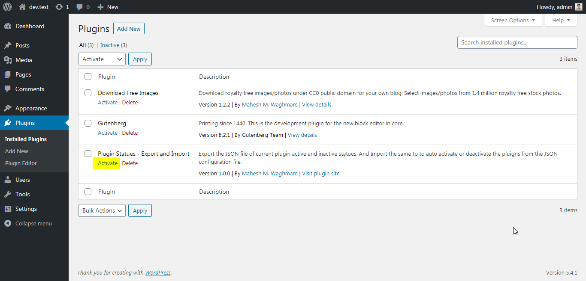
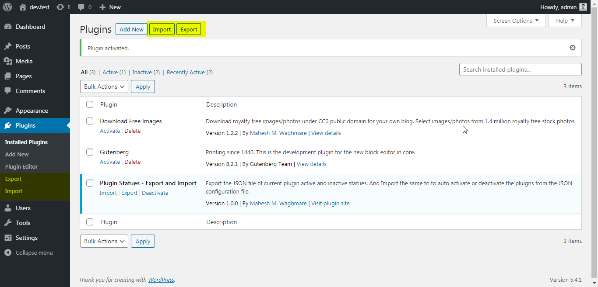
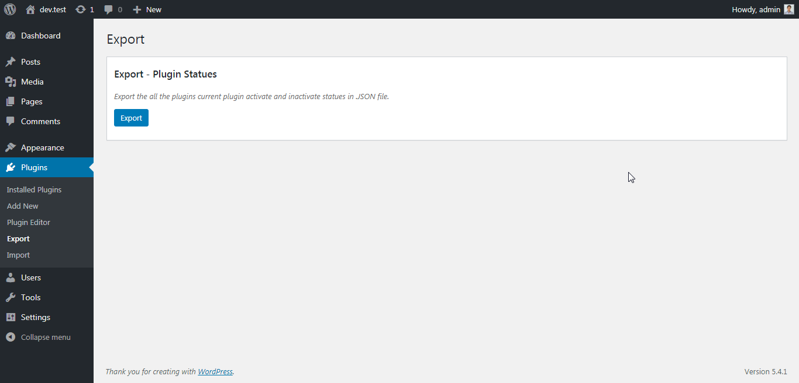
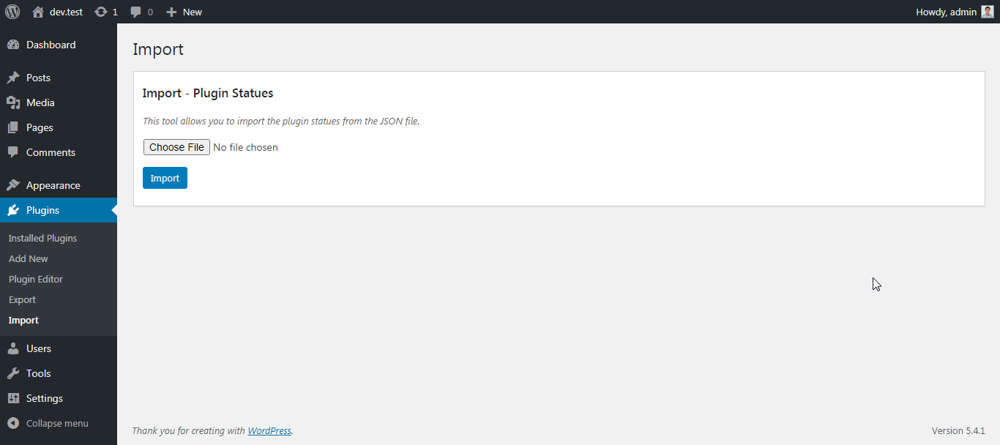

# Plugin Statues - Export and Import

Generally while providing the support for the end user most of the times the issue is with 3rd party plugins.

While checking which plugin was creating a conflict, We first note all the active plugins. Then deactivate all plugins, manually activate 1 by 1 plugins. And finally knowing which plugin was creating the cofnlict we activeate all the plguins on users website which was we listed before.

The plugin **"Plugin Statues - Export and Import"** help us to export the list of all plugin with there active and inactive statues.

We can use the exported JSON file to re-set the active and inactive plugins.

See video - https://maheshwaghmare.com/how-to-use-the-plugin-statues-wordpress-plugin-mp4/

### Activate Plugin

### Import and Export Links

### Export Screen

### Import Screen

